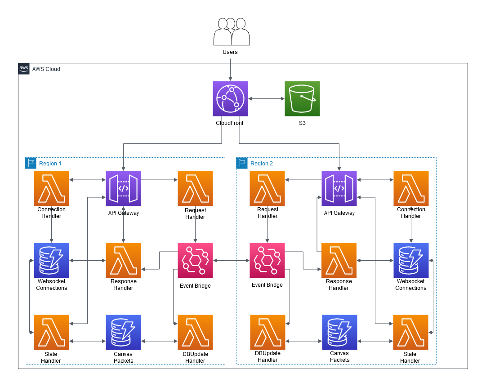

## Solution Overview



### Prerequisites for working and deploying

- An [AWS account](https://portal.aws.amazon.com/billing/signup#/start)
- Installed and authenticated [AWS CLI](https://docs.aws.amazon.com/en_pv/cli/latest/userguide/cli-chap-install.html) (authenticate with an [IAM](https://docs.aws.amazon.com/IAM/latest/UserGuide/getting-started.html) user or an [AWS STS](https://docs.aws.amazon.com/STS/latest/APIReference/Welcome.html) Security Token)
- Installed and setup [AWS Cloud Development Kit (AWS CDK)](https://docs.aws.amazon.com/cdk/latest/guide/getting_started.html)
- Installed Node.js, TypeScript and git

#### Parts of the file system and their function

```
.
├── cdk             CDK code that defines our environment
├── img             Architecture image
└── src
    └── lambda      Handler code of the lambda function used to distribute the Lambda layer
```


#### Install dependencies

node.js dependencies are declared in a `package.json`.
This project contains a `package.json` file in two different folder: 
- `cdk`: Dependencies required to deploy your stack with the CDK
- `src`: Dependencies required for the Lambda function, i.e. TypeScript types for AWS SDK 

Navigate to each of the folders and run `npm install`

#### Deploy application

Navigate to the `cdk` folder and run the following commands. 

`cdk synth` will synthesize a CloudFormation template from your CDK code. If you haven't worked with CDK in your account before, you need to [bootstrap](https://docs.aws.amazon.com/cdk/v2/guide/bootstrapping.html) the required resources for the CDK with `cdk bootstrap`, otherwise skip this step. Note that bootstrapping needs to be performed in every Region you plan to deploy to. You can then deploy the template with `cdk deploy`.

When synthesized and regions bootstrapped in an earlier command, you can just deploy it. There is also no need to `cdk destroy --all` before redeploying. Redeploying without destroying will cause the web socket endpoints to remain the same.


```
cdk synth 
# replace account id and Region codes
cdk bootstrap 123456789012/us-east-1 123456789012/eu-west-1 
cdk deploy --all
```

## Cleaning up

Run the following command to shut down the resources created.

```
cdk destroy --all
```
